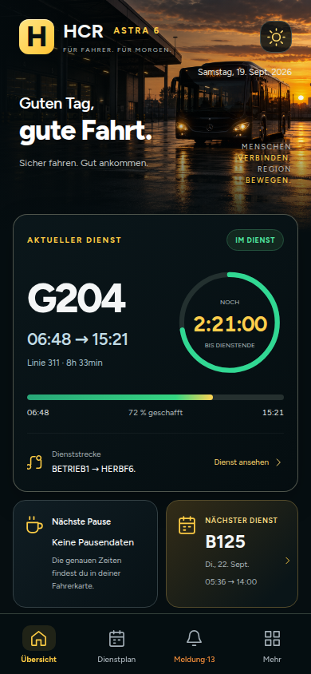
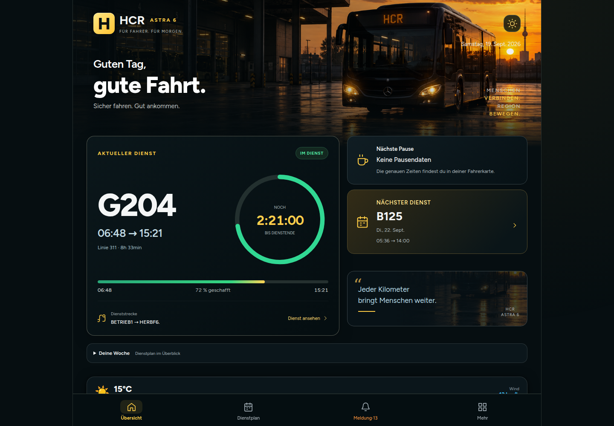
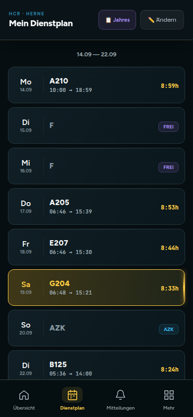

# HCR Astra — proposition de design

L’accueil reprend la référence fournie : fond charbon, accents dorés, photo de bus au coucher du soleil, service au premier plan, compteur circulaire, pause et prochain service. Le planning et les fiches conservent leurs fonctions et adoptent les mêmes couleurs.

La présentation lit le planning existant. Elle ne remplace pas les données enregistrées et n’ajoute pas de compte utilisateur. Sans prénom configuré, le titre reste « gute Fahrt. ». Les captures utilisent un planning de test et une date fixe ; ces données ne sont pas ajoutées à l’application.

## Fichiers

- `astra-design.js` : présentation de l’accueil, états du service, pauses explicites, prochain service et navigation au clavier dans le planning.
- `astra-design.css` : styles adaptatifs, thèmes sombre/clair et réduction des animations.
- `assets/depot-sunset.png` : visuel original généré avec l’outil intégré Imagegen.
- `index.html` : chargement du thème, zoom mobile autorisé, correction du calcul d’un service personnalisé sans données DB, cohérence de l’onglet de détail et emplacement du widget météo.
- `sw-3.js` : nouvelle version du cache avec les fichiers du thème et nettoyage limité aux caches de cette application.

## Vérifications réalisées

Chromium : largeurs 320, 390, 768 et 1440 px ; absence de débordement de l’accueil ; compte à rebours et progression ; fiche du service et prochain service ; Fahrerkarte ; navigation clavier ; thème clair ; jour libre ; planning vide ; service à cheval sur minuit ; horaires manquants ; absence de pauses inventées ; stockage inchangé pendant le rendu. Rechargement hors ligne vérifié avec les nouveaux fichiers en cache. Aucune erreur JavaScript relevée pendant ces scénarios.

Les services externes de météo, GPS et échange de services n’ont pas fait l’objet d’une validation complète. Le style seul ne garantit pas leur disponibilité.

## Provenance du visuel

Mode : outil intégré Imagegen. Fichier final : `assets/depot-sunset.png`.

Prompt :

> Create a photorealistic landscape website hero background, 1536x1024. Cinematic German city bus depot at sunset, modern dark city bus seen front three-quarter on the RIGHT half of frame, warm amber headlights, small amber destination display reading HCR, wet asphalt reflecting golden late sunset, industrial depot roof on left. Deep nearly black teal shadows, restrained amber highlights, realistic photography, premium quiet mood. LEFT third is dark empty architectural negative space for live text overlay. No people. No typography overlays, no UI, no phone, no frames, no watermark. This is a background asset for a bus driver's HCR application, matching a charcoal and gold interface.
